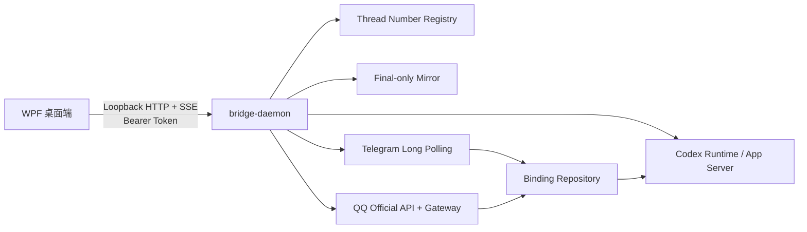

# CloudLight Codex Bridge

CloudLight Codex Bridge 是面向 Windows 的本机 Codex 控制桥。它由现代化 WPF 桌面端和仅监听回环地址的 Go `bridge-daemon` 组成，让用户可以浏览并继续现有 Codex Thread、使用稳定的 `#N` 会话编号、从 Telegram 或 QQ 官方机器人远程发送任务，并把 Codex 最终回答安静地同步到指定渠道。

当前版本：`0.7.0`

## 主要能力

- Windows 11 / Fluent 风格桌面界面，支持系统、浅色和深色主题。
- 概览、Codex 会话、远程渠道、消息同步、备份与恢复、设置和运行日志页面。
- 浏览真实 Codex Thread，显示稳定的 `#N` 编号、标题、工作目录、状态和更新时间。
- 在现有 Thread 中发送或停止 Turn，不创建额外 Thread，不修改当前 Runtime 安全策略。
- 消息、错误、Request User Input、工具输出和日志正文均可鼠标选择，并支持 `Ctrl+A`、`Ctrl+C` 和右键复制。
- Telegram Long Polling 远程渠道。
- QQ 开放平台官方机器人 C2C 与群聊 @机器人渠道。
- `#N 消息` 精确路由到指定 Thread，也支持每个远程会话建立固定 Binding。
- Final-only Mirror：一个 Turn 只同步一次最终回答，每个平台最多发送一次。
- 完整备份和恢复 Codex 用户目录以及 CloudLight Codex Bridge 数据。
- 开机自启、`--silent` 静默启动、系统托盘和窗口状态恢复。
- 每用户 Windows 安装包，不要求管理员权限，安装包自带 .NET 桌面运行时。

## 系统要求

- Windows 10 1809 或更高版本，x64。
- 已安装并能正常使用 Codex CLI 或 Codex Desktop。
- Codex 已完成登录；Bridge 不替代 Codex 的登录流程。
- 使用 Telegram 或 QQ 时，需要能够连接对应平台 API。

安装包已经包含运行桌面端所需的 .NET 8 Windows Desktop Runtime。使用便携版时，如果运行环境缺少对应 Runtime，请改用完整安装包。

## 下载、校验与安装

0.7.0 的完整安装包位于：

```text
artifacts\win-x64-0.7.0\CloudLight-CodexBridge-Setup-0.7.0-win-x64.exe
```

同目录提供 SHA-256 文件。也可以手动校验：

```powershell
Get-FileHash .\CloudLight-CodexBridge-Setup-0.7.0-win-x64.exe -Algorithm SHA256
```

安装器默认安装到：

```text
%LOCALAPPDATA%\Programs\CloudLight Codex Bridge
```

安装特点：

- 仅为当前 Windows 用户安装。
- 不写入 HKLM，不需要管理员权限。
- 创建开始菜单快捷方式，可选创建桌面快捷方式。
- 升级时使用稳定 AppId 识别已有安装。
- 卸载时删除程序文件、快捷方式和本应用的 HKCU 开机启动项。
- 卸载不会删除 Codex 数据、Bridge 设置、Binding、Thread 编号、日志或 Secret。

便携版可以直接运行：

```text
artifacts\win-x64-0.7.0\CloudLight.CodexBridge.exe
```

## 首次启动

1. 启动 CloudLight Codex Bridge。
2. 桌面端启动随包附带的 `bridge-daemon.exe`。
3. daemon 在 `127.0.0.1` 上选择随机端口，并用一次性 Bearer Token 保护本机 API。
4. daemon 检测 Codex CLI，启动 Codex App Server，并加载真实 Thread。
5. 顶部状态显示“已连接 · PID …”后即可使用。

如果自动检测不到 Codex，可在“设置 → Codex”中指定 `codex.exe`。Bridge 不会修改 Codex 全局 Sandbox、Approval、Model 或 Reasoning 配置。

## 页面说明

### 概览

概览页集中显示：

- Codex 连接状态和会话数量。
- QQ、Telegram 运行与连接状态。
- Final-only Mirror 状态。
- 当前 Thread 和正在运行的 Turn。
- 最近活动摘要。

### Codex 会话

左侧会话列表以 `#N` 和标题为主要标识，并显示工作目录、更新时间与运行状态。右侧显示 Thread 元数据、历史消息、工具事件和当前交互。

常用操作：

- “打开”：读取并显示 Thread。
- “复制 #N”：复制稳定会话编号。
- “停止”：中断当前可停止 Turn。
- “发送”：在当前 Thread 中继续对话。
- “…”：打开低频操作。

Thread ID 仍然保留用于诊断，但不会取代更易读的 `#N` 编号。

### 远程渠道

Telegram 和 QQ 官方机器人使用统一的状态、凭据、网络、权限、Allowlist 与 Binding 布局。高级配置默认折叠，避免主页面堆积输入框。

### 消息同步

消息同步默认采用安静的 Final-only 语义：

```text
一个 Turn → 一个最终回答 → 每个平台最多发送一次
```

可分别配置 Telegram Chat ID 和 QQ OpenID，并选择是否发送 Request User Input、错误或停止通知。不会同步用户消息、流式 Delta、普通 Status 或 Tool 事件。

### 备份与恢复

备份页面显示当前 Codex 数据位置、估算大小、备份内容、进度和最近操作。备份与扫描在后台运行，创建备份时可以取消；恢复开始覆盖后不能中途取消。

### 设置

设置页包括：

- 常规：关闭时最小化到托盘、恢复上次页面、自动刷新 Thread、刷新间隔。
- 启动：开机自启、静默启动、自动启动 QQ、Telegram 和消息同步。
- 外观：跟随系统、浅色、深色。
- 窗口：保存 Width、Height、Left、Top、最大化状态和最后页面。
- 数据位置：Bridge 数据、设置和日志目录。
- Codex：Codex CLI 检测和自定义路径。

窗口恢复时会检查当前显示器工作区；如果原位置已经离开可见屏幕，会自动修正。

## `#N` Thread 路由

Bridge 为发现的真实 Thread 分配稳定编号，例如 `#41`。编号持久化后不会因为列表排序或重启而重新编号。

在 Telegram 或 QQ 中可以直接发送：

```text
#41 继续完成剩余功能
```

这条消息会直接进入 `#41` 对应的现有 Thread。也可以对指定 Thread 使用命令：

```text
#41 /status
#41 /stop
#41 /cancel
```

不带 `#N` 的普通消息使用当前远程会话 Binding。未绑定时，Bridge 会要求先指定编号或建立 Binding，不会猜测目标 Thread。

## 远程命令

常用命令：

| 命令 | 作用 |
| --- | --- |
| `/start` | 显示渠道就绪和绑定状态 |
| `/help` | 显示命令帮助 |
| `/status` | 显示当前 Runtime/Binding 状态 |
| `/threads` | 列出最近 Thread 和 `#N` 编号 |
| `/thread <编号或 ID>` | 显示指定 Thread |
| `/bind <编号或 ID>` | 将当前远程会话绑定到现有 Thread |
| `/unbind` | 删除当前 Binding |
| `/current` | 显示当前 Binding |
| `/stop` | 停止由当前远程地址发起且仍可控制的 Turn |
| `/cancel` | 取消当前地址正在等待的 Request User Input |

QQ 的 `/bind` 支持 `/threads` 列表序号、`#N`、完整 Thread ID 或唯一前缀；临时 `/threads` 序号列表在 5 分钟后过期。Telegram 可以直接使用 `#N` 路由，Binding 以真实 Thread ID 为准。

远程消息只进入已存在且可发送的 Thread。它不会新建、Fork、排队或自动重发任务，也不会覆盖 Runtime 当前的 Sandbox、Approval、Model 或 Reasoning。

## Telegram 配置

1. 使用 BotFather 创建 Bot 并取得 Token。
2. 打开“远程渠道 → Telegram”。
3. 保存 Token，配置允许访问的 Telegram User ID。
4. 根据网络环境选择：
   - `environment`：使用当前进程环境代理。
   - `direct`：不使用代理。
   - `custom-http`：使用指定 HTTP 代理。
5. 测试凭据和代理。
6. 启动 Telegram 渠道。
7. 在 Telegram 中发送 `/threads`，然后使用 `#N 消息` 或建立 Binding。

Token 使用 Windows DPAPI CurrentUser 独立保存，不写入 `settings.json`，也不会通过状态 API 返回。

## QQ 官方机器人配置

QQ 渠道使用 QQ 开放平台官方 AppID、AppSecret、HTTP API 和 Gateway WebSocket。

1. 在 [QQ 开放平台](https://q.qq.com/) 创建机器人。
2. 配置 C2C 与群聊 @机器人消息事件权限。
3. 在“远程渠道 → QQ 官方机器人”填写 AppID。
4. 安全保存 AppSecret。
5. 选择环境代理、直接连接或自定义 HTTP 代理。
6. 依次执行“测试凭据”“测试网络”。
7. 启动 Bot，确认 Gateway 已连接。
8. 给 Bot 发送消息，在“最近发现的 QQ 身份”中查看 User、Group 和 Member OpenID。
9. 将需要授权的 OpenID 加入 Allowlist。
10. 发送 `/threads`，使用 `#N 消息` 或 `/bind` 路由到现有 Thread。

QQ 当前只支持文本 C2C 与群聊 @机器人事件。C2C 要求 User OpenID 在 Allowlist；群聊同时校验 Group OpenID 和 Member OpenID。未授权身份默认拒绝，不会把消息正文写入发现列表。

AppSecret 使用 Windows DPAPI CurrentUser 保存到：

```text
%LOCALAPPDATA%\CloudLight\CodexBridge\secrets\qqbot-app-secret.dat
```

Access Token 只在 daemon 内存中缓存并提前刷新。AppSecret、Access Token、完整 Gateway Session 和消息正文不会出现在普通状态 API、SSE 或日志中。

## Request User Input 与停止任务

当 Codex 请求用户输入时，Bridge 保存 Thread、Turn、Interaction、渠道地址和发起用户之间的关联：

- 发起任务的远程用户可以用选项序号或文本回答。
- 群聊中只有原始发起成员可以回答对应交互。
- `#N 回答` 可以明确指定等待交互的 Thread。
- `/cancel` 取消当前远程地址可控制的交互。
- `/stop` 只能停止由当前远程地址发起且仍可控制的 Turn。
- Approval 不会通过 Telegram 或 QQ 批准或拒绝，仍需在本机 Codex/WPF 中处理。

## Final-only Mirror

Mirror 监听所有已知 Thread，但只在持久化验证完成后读取正式 assistant 最终消息。默认行为：

- Assistant Final：开启。
- Request User Input：可选，默认开启。
- 错误/停止通知：可选，默认开启。
- User、Delta、普通 Status、Tool：关闭且不作为主要同步内容。

Mirror 为每个平台维护独立游标和发送记录。一个 Turn 即使产生多个流式事件，也不会向同一平台重复发送最终回答。

## 完整备份

Codex 数据目录按以下顺序检测：

1. 非空的 `CODEX_HOME` 环境变量。
2. `%USERPROFILE%\.codex`。

“Codex 数据”会递归扫描该目录当前实际存在的全部文件和子目录，不使用文件扩展名白名单。sessions、rollout、配置、历史、数据库、状态、skills、prompts、profiles、凭据和其他未知文件类型都会按原始相对路径处理。

“CloudLight Codex Bridge 数据”覆盖：

```text
%LOCALAPPDATA%\CloudLight\CodexBridge
%APPDATA%\CloudLight\CodexBridge
```

这包括 settings、Binding、Thread Number Registry、Mirror Cursor、日志和 DPAPI Secret 等实际存在的数据。完整备份可能包含账号凭据，必须妥善保存备份文件。

备份生成单个 `.clcbak` 文件，本质为 ZIP 容器：

```text
manifest.json
codex\...
bridge\local\...
bridge\roaming\...
```

Manifest 记录：

- 格式版本、创建时间、应用版本和可取得的 Codex 版本。
- 机器名、原 Codex Home、包含内容。
- 文件总数和总大小。
- 每个文件的相对路径、大小、最后修改时间和 SHA-256。
- 最终仍无法读取的文件列表。

文件读取会合理重试，并允许读取正在被共享打开的文件。如果仍存在失败文件，界面会显示“备份完成，但有 N 个文件未能读取”，不会宣称完整备份成功。

## 导入与恢复

选择 `.clcbak` 后，Bridge 会先读取并显示备份时间、版本、Codex 版本、文件数量、大小和包含内容。

恢复模式：

- 完整替换（推荐）：把所选数据目录恢复到备份时的文件状态，删除备份中不存在的当前文件。
- 合并（高级）：按原始相对路径导入当前不存在的文件，不解析或重写 Thread/Session ID。

完整替换流程：

1. 验证 Manifest、容器路径、文件大小和全部 SHA-256。
2. 在“文档\CloudLight Codex Backups”自动创建 `PreRestore-YYYYMMDD-HHMMSS.clcbak`。
3. 如果 PreRestore 备份不完整，立即停止，不执行覆盖。
4. 停止 Bridge 自己启动的 Codex App Server。
5. 检查外部 Codex Desktop/CLI/app-server；仍在写入时要求用户关闭后重试。
6. 解压到临时目录并验证文件。
7. 以目录级移动和回滚方式尽量安全地替换数据。
8. 恢复 Bridge 数据、重新加载设置和 Repository。
9. 重启 Runtime 并刷新 Thread 列表。

损坏、缺失或 SHA-256 不一致的备份会在覆盖前被拒绝。

DPAPI Secret 可以原样备份。在同一 Windows 用户下恢复后可继续使用；换用户或换机器后可能无法解密，此时渠道会标记 Secret 需要重新配置，其他数据仍可正常恢复。

## 启动、托盘与窗口行为

开机自启使用当前用户注册表：

```text
HKCU\Software\Microsoft\Windows\CurrentVersion\Run
Value: CloudLight Codex Bridge
```

启用静默启动时，注册值为：

```text
"CloudLight.CodexBridge.exe" --silent
```

`--silent` 不创建主窗口、不弹普通错误 MessageBox，但仍会启动 daemon，并按设置启动 Telegram、QQ 和 Mirror。

关闭窗口默认最小化到系统托盘。托盘菜单支持打开主窗口、查看当前状态、打开设置和退出。首次关闭到托盘时会显示提示，避免用户误认为程序已经退出。

## 数据目录

| 内容 | 位置 |
| --- | --- |
| 桌面设置 | `%APPDATA%\CloudLight\CodexBridge\settings.json` |
| Bridge 本地数据 | `%LOCALAPPDATA%\CloudLight\CodexBridge` |
| Binding | `%LOCALAPPDATA%\CloudLight\CodexBridge\bindings.json` |
| Thread 编号 | `%LOCALAPPDATA%\CloudLight\CodexBridge\data\thread-numbers.json` |
| Mirror 状态 | `%LOCALAPPDATA%\CloudLight\CodexBridge\data\mirror-state.json` |
| daemon 日志 | `%LOCALAPPDATA%\CloudLight\CodexBridge\logs\bridge-daemon.log` |
| Telegram Token | `%LOCALAPPDATA%\CloudLight\CodexBridge\secrets\telegram-token.dat` |
| QQ AppSecret | `%LOCALAPPDATA%\CloudLight\CodexBridge\secrets\qqbot-app-secret.dat` |
| 默认 Codex Home | `%USERPROFILE%\.codex` |

损坏的 `settings.json` 不会被自动覆盖；程序会尽量保留原文件并生成 `.corrupt-时间戳.bak` 后使用默认设置。

## 架构与安全边界



- daemon 只允许监听 `127.0.0.1`，拒绝非回环监听地址。
- 桌面端启动 daemon 时生成随机本机 Token，API 请求必须携带 Bearer Token。
- QQ 与 Telegram 使用独立凭据、代理、Adapter、Context、Binding 和交互状态。
- 远程任务沿用 Runtime 已生效的安全策略，不允许远程覆盖 Sandbox、Approval、Model 或 Reasoning。
- 日志和状态 DTO 对 Token、Secret、代理凭据和消息正文做隔离或脱敏。

更详细的内部设计见 [docs/architecture.md](docs/architecture.md)。

## 从源码构建

依赖：

- .NET 8 SDK
- Go 1.26 或兼容版本
- Inno Setup 6/7（仅构建安装包需要）

构建便携版：

```powershell
.\scripts\build.ps1 -Version 0.7.0
```

脚本默认输出 `artifacts\win-x64-0.7.0`，并拒绝覆盖已经存在的版本目录。也可以传入独立输出目录：

```powershell
.\scripts\build.ps1 -Version 0.7.0 -OutputDirectory D:\temp\codex-bridge-0.7.0
```

构建自包含 Windows 安装包：

```powershell
.\scripts\build-installer.ps1 -Version 0.7.0
```

安装包脚本会：

1. 生成 `win-x64` 自包含发布目录。
2. 编译 Go daemon。
3. 复制许可证和第三方声明。
4. 使用 Inno Setup 压缩为单个 EXE。
5. 生成对应 SHA-256 文件。
6. 清理临时安装器 staging 目录。

构建脚本不会执行 Git 操作，也不会修改 Codex 全局配置。

## 定向验证

WPF Release Build：

```powershell
dotnet build .\apps\desktop\CloudLight.CodexBridge\CloudLight.CodexBridge.csproj -c Release
```

备份/恢复与启动项 Smoke：

```powershell
dotnet run --project .\tests\CloudLight.CodexBridge.Smoke -c Release
```

核心 Go 回归：

```powershell
go -C .\services\bridge-daemon test ./internal/threadregistry ./internal/telegram ./internal/qqbot ./internal/mirror ./internal/runtime
```

Smoke 测试只使用临时模拟 Codex/Bridge 目录，不会对用户真实 `.codex` 执行覆盖恢复。

## 本机 API

主要端点：

- `GET /api/v1/status`
- `GET /api/v1/threads`
- `GET /api/v1/threads/{threadId}`
- `POST /api/v1/threads/{threadId}/turns`
- `POST /api/v1/threads/{threadId}/turns/{turnId}/interrupt`
- `POST /api/v1/threads/{threadId}/persistence/verify`
- `GET|POST|DELETE /api/v1/bindings`
- `GET|PUT /api/v1/mirror`
- `GET /api/v1/channels/telegram/status`
- `POST /api/v1/channels/telegram/configure|test|start|stop`
- `GET /api/v1/channels/qqbot/status`
- `POST /api/v1/channels/qqbot/configure|test|network-test|start|stop`
- `POST|DELETE /api/v1/channels/qqbot/secret`
- `GET /api/v1/channels/qqbot/discovered-identities`
- `GET /api/v1/events`

这些 API 面向同一进程树中的桌面端使用；端口和 Token 都是运行期信息，不是稳定的公共远程 API。

## 项目结构

```text
apps/desktop/CloudLight.CodexBridge/   WPF 桌面端
services/bridge-daemon/                Go 本机 daemon
installer/                             Inno Setup 安装器定义
scripts/                               构建与清理脚本
tests/                                 定向 Smoke 测试
docs/                                  架构、开发与验收文档
licenses/                              第三方许可证
artifacts/                             本机构建产物，不提交 Git
```

## 故障排查

### 顶部一直显示未连接

- 打开“运行日志”，确认 `bridge-daemon.exe` 是否成功启动。
- 检查安全软件是否阻止本地子进程。
- 在设置中确认 Codex CLI 路径。
- 确认 Codex CLI 本身可以在当前 Windows 用户下运行。

### Telegram 或 QQ 无法连接

- 先使用页面中的凭据测试和网络测试。
- 检查代理模式；`custom-http` 只接受无内嵌用户名密码的 HTTP URL。
- QQ 确认已在开放平台授予对应 C2C/群聊事件与 Intent。
- 检查 Allowlist；未授权身份不会执行远程任务。

### 消息没有进入预期 Thread

- 发送 `/threads` 查看当前稳定编号。
- 使用 `#N 消息` 明确指定 Thread。
- 使用 `/current` 检查当前 Binding。
- Thread 忙碌、归档或正在等待交互时不会接受新 Turn。

### 恢复被拒绝

- 关闭外部 Codex Desktop、CLI 和 app-server 后重试。
- 检查界面是否报告损坏、缺少文件或 SHA-256 不一致。
- 完整替换前的 PreRestore 备份失败时，Bridge 会拒绝继续覆盖。

## 已知限制

- QQ 官方机器人当前只支持文本 C2C 与群聊 @机器人消息。
- 不支持图片、文件、语音、视频、频道扩展或好友/群管理。
- 不支持远程 Approval、新建 Thread、Fork、持久远程队列或自动重发 Prompt。
- 恢复采用文件/目录级语义，不智能解析 JSON 或重写 Session/Thread ID。
- 完整恢复要求外部 Codex 进程停止写入数据目录。
- DPAPI Secret 跨 Windows 用户或机器恢复后需要重新配置。
- 0.7.0 安装包尚未进行商业代码签名，也不包含自动更新。

## 许可证与第三方声明

第三方许可证和来源说明位于：

- [THIRD_PARTY_NOTICES.md](THIRD_PARTY_NOTICES.md)
- [licenses](licenses)

开发、定向测试和人工验收流程见 [docs/development.md](docs/development.md)。
